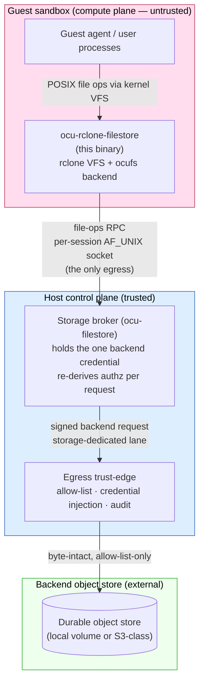
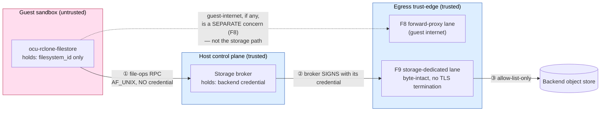
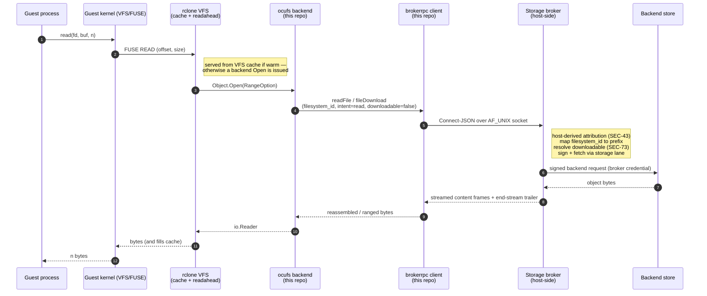
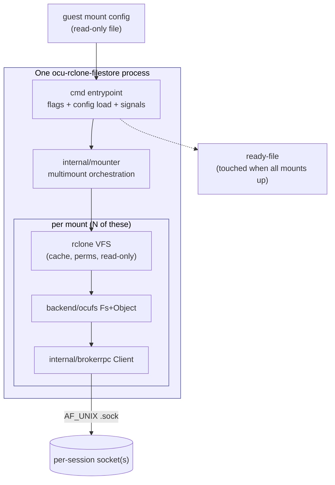
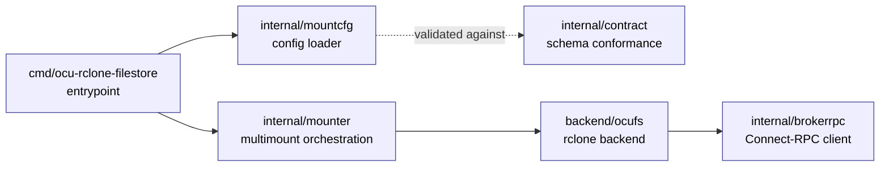

<!-- SPDX-License-Identifier: FSL-1.1-Apache-2.0 -->
<!-- Copyright (c) 2025 Open Computer Use Contributors -->

# Architecture — ocu-rclone-filestore

This document explains, end to end, what the guest-side mount binary is, where
it sits in the Open Computer Use system, the trust boundaries it lives inside,
how a single file operation travels from a process in the guest all the way to
durable storage, and which package in this repository discharges each promise.

The **source of truth** for the system architecture is the canon in
[`Wide-Moat/open-computer-use`](https://github.com/Wide-Moat/open-computer-use)
under `docs/architecture/`. This document restates the parts that bear on this
binary in the project's own words; where it cites a behaviour it cites a
contract (`contracts/storage/*.schema.json`), an NFR row
(`manifesto/02-nfrs.md`), or an ADR. It never re-decides what an ADR decided.

Companion documents:

- [`requirements.md`](./requirements.md) — the invariants and defaults the
  binary must satisfy, distilled from the canon.
- [`fork-shape.md`](./fork-shape.md) — why the binary is a thin wrapper module
  over rclone rather than a source fork, and the exact rclone seams it relies on.
- [`e2e-local.md`](./e2e-local.md) / [`ci-fuse-decision.md`](./ci-fuse-decision.md)
  — how the real end-to-end exercise is run and gated.

---

## 1. What this binary is, in one paragraph

It is the **guest-side mount binary**. It runs as an ordinary process inside the
session sandbox. Given a host-supplied mount configuration that names one or
more per-session filesystem scopes, it presents each scope as a directory tree
in the guest filesystem (a FUSE mount) and translates every file operation the
guest performs — `open`, `read`, `write`, `readdir`, `rename`, `unlink`, … —
into a call on the broker's file-operations RPC. It serves nothing, proxies
nothing, and exposes no network facade. It holds **no backend credential, no
object-store client, and no second transport**: the only handle it carries is a
session-scoped `filesystem_id`, and its only egress is a per-session unix socket
to the broker.

The binary is built on [rclone](https://github.com/rclone/rclone) (MIT). rclone
supplies the FUSE/VFS mount machinery; this repository adds one backend package
(`ocufs`) that speaks the broker RPC where a stock rclone backend would speak an
object-store protocol, plus the multi-mount entrypoint that drives rclone's
mount machinery. The diff against upstream rclone is zero — see
[`fork-shape.md`](./fork-shape.md).

---

## 2. System context — where the mount sits

The binary is one participant in a larger system. The diagram below is the
context view, scoped to the storage path; the full system context lives in the
canon (`docs/architecture/03-c4-context.md`).

The Mermaid source below is the maintainable version of the same view; the
rendered SVG above is generated from [`diagrams/01-big-picture.d2`](./diagrams/01-big-picture.d2).

Key relationships:

- **The guest agent never talks to storage directly.** It performs ordinary file
  operations against a mounted directory; this binary is the only thing that
  turns those into RPC.
- **This binary never talks to the backend store directly.** Its sole outbound
  channel is the per-session unix socket to the broker. There is no object-store
  client linked into the binary and no network path to any backend (SEC-25,
  SEC-16). The build-graph denylist CI gate enforces this mechanically.
- **The broker is the only component that holds the backend credential**, signs
  backend requests, and re-derives authorization for every operation.

---

## 3. Trust boundaries and the credential seam (the "hole in the host")

This is the load-bearing security property and the most common point of
confusion, so it is documented precisely. The question is: *if the guest holds
no credential, where do the bytes actually leave the trusted boundary, and where
is the credential attached?*

The answer is that there is **no single backdoor "hole"** punched through the
host. Instead, the guest is structurally credential-free and **three distinct
host-side mediation points** stand between a guest file operation and durable
storage. The guest reaches the broker through one narrow, host-mediated channel
(a per-session unix socket); everything secret happens on the far side of it.

### 3.1 The zones

| Zone | Trust | What runs there | Relevant to this binary |
|---|---|---|---|
| Compute plane | **Untrusted** | The session sandbox; the guest agent; **this binary** | This binary lives here. Anything it holds is assumed reachable by an adversary. |
| Host control plane | **Trusted** | Session lifecycle; **the storage broker** | The broker is the peer on the other end of the unix socket. |
| Egress trust-edge | **Trusted** | Forward proxy + credential injector | This binary's traffic never reaches the public internet; the broker's backend traffic does, through here. |
| Backend object store | **External** | The durable store (local volume or S3-class) | This binary never names it, never dials it, never sees its protocol. |

### 3.2 The two egress lanes

There are two physically distinct lanes out of the trusted boundary, and they
carry different things:

- **The storage path is hop ① → ② → ③.** The guest's file-ops RPC crosses the
  sandbox boundary over a **per-session AF_UNIX socket** and lands at the broker.
  *No credential travels on hop ①.* The broker then originates the backend
  request, **signs it with its own credential** (hop ②), and that signed request
  leaves through the **storage-dedicated egress lane** (hop ③, canon ADR-0011 /
  SEC-85): allow-list-only, byte-intact, no TLS termination, so the broker's
  signature is preserved end to end. That lane is out-of-process from the broker,
  so even a compromised broker cannot silence the edge's enforcement.
- **The guest-internet forward-proxy lane (F8)** is a *different* lane for a
  *different* purpose (a guest process reaching an allow-listed external API);
  it is where upstream-API credential injection happens (canon ADR-0005/0007,
  Envoy SDS). **This binary does not use it.** It is shown only to make clear
  that the storage path and the guest-internet path are separate.

### 3.3 The three credential-mediation points

1. **The unix socket is the narrow channel.** The guest's only way to reach
   storage is the per-session AF_UNIX socket named for its `filesystem_id`. The
   broker accepts a connection on it only from the same uid and attributes the
   caller by **host-derived identity** (the socket's provenance), never by the
   id the guest asserts in the request body (SEC-43). A guest-supplied
   `filesystem_id` is a *hint* the broker cross-checks, not a capability.
2. **The broker custodies and signs.** The one backend credential lives only in
   the broker (zone "trusted"). The broker maps `filesystem_id` to a backend
   prefix the guest never sees, resolves the object, checks the broker-side
   `downloadable` policy (SEC-73), and signs the backend request itself.
3. **The storage egress lane enforces, out-of-process.** The signed request
   crosses to the backend only through the storage-dedicated lane, which forwards
   allow-list-only and byte-intact and emits an audit event per operation
   (SEC-85, SEC-16).

The net effect: the worst an adversary with full control of the guest can do is
issue file-ops RPC against *its own* session scope over *its own* socket. It
cannot forge another session's identity (host-derived attribution), cannot
obtain the backend credential (it never enters the guest), cannot reach the
backend store on a second path (no object-store client is linked, no network
route exists), and cannot turn a non-downloadable object into an exfiltrable one
(that decision is broker-resolved and the guest never sets `downloadable=true`).

### 3.4 How this binary upholds its end

This binary's responsibility in the credential seam is **to hold nothing and to
assert nothing it is not entitled to**. Concretely:

- It refuses any mount config that carries a provision-side credential marker
  (`auth_token`, `ca_cert_pem`) — both by strict-decoding (unknown field) and by
  an explicit, independently-tested refusal (`internal/mountcfg`).
- It constructs **no** `Authorization` header and **no** credential header
  anywhere on the RPC path (`internal/brokerrpc`).
- It has **no** code path that sets `downloadable` to `true` — the field is
  stamped `false` on every request body, centrally (`internal/brokerrpc`).
- It links **no** object-store client; the only egress is the configured unix
  socket (enforced by the build-graph denylist CI gate).

---

## 4. The data path of one file operation

The diagram below traces a guest `read()` of a file, from syscall to bytes,
naming every hop. A `write()` is the mirror image (the broker signs a `PutObject`
instead of a `GetObject`, and the upload is chunked client-streaming).

The rendered SVG above is generated from [`diagrams/02-file-path.d2`](./diagrams/02-file-path.d2);
the Mermaid sequence below is the maintainable source.

Two facts the diagram makes precise:

- **Where caching sits.** The rclone VFS holds a per-mount cache. A warm read is
  served locally without touching the broker — which is why the end-to-end test
  proves the *broker* data path by reading the broker's own workspace, not by
  reading back through the mount (a read-back can be cache-served).
- **Where authorization is decided.** Not here. The mount stamps `intent` (read)
  and `filesystem_id`, and always `downloadable=false`. The broker re-derives the
  three authorization axes against host-attested identity and decides. The mount
  is a translator, not a policy point.

---

## 5. The broker south face — the contract this binary speaks

The binary speaks exactly one protocol: the broker's file-operations RPC. The
operation set and authorization axes are pinned by
`contracts/storage/file-ops.schema.json` in the canon; the transport details are
the component spec's.

- **Transport.** Connect-RPC, JSON codec, over a **per-session AF_UNIX socket**.
  Unary ops are `POST application/json` to
  `/ocu.filestore.v1alpha.FilesystemService/<Op>` with `Connect-Protocol-Version: 1`.
  `fileUpload` is Connect **client-streaming** (a params frame, then ceiling-sized
  chunk frames, then an end-stream frame). `fileDownload` is Connect
  **server-streaming** (content frames, then an end-stream trailer). For streams,
  success or failure comes from the **end-stream trailer**, never the HTTP status.
- **The 18 operations.** `listDirectory`, `makeDirectory`, `moveDirectory`,
  `removeDirectory`; `createFile`, `readFile`, `readMetadata`, `getFileMetadata`,
  `listFiles`, `copyFile`, `moveFile`, `removeFile`; `fileUpload`, `fileDownload`,
  `importFiles`, `importZip`; `migrateFilesystem`, `removeFilesystem`. Each maps
  to a fixed `intent` via a single authoritative table; the mount issues only
  `read` and `write` intents (it never requests `preview`).
- **Three authorization axes, on every request.** `filesystem_id` (the scope
  handle, a *hint* the broker cross-checks against host-derived identity),
  `intent` (`read`/`write`, derived centrally from the op), and `downloadable`
  (always `false` from the guest — the perimeter-exit decision is broker-resolved,
  SEC-73).
- **Throttling and denials.** Per-session ceilings are broker-side (SEC-46). A
  retryable refusal (`resource_exhausted`/`unavailable`) is mapped to a
  back-off-with-retry error (honouring a `Retry-After` hint when present); the
  closed-class denials map to permanent errors. The mount tolerates throttling as
  backpressure; it never simulates or enforces a ceiling itself.

The detailed message map and chunk arithmetic live in the `brokerrpc` package
documentation; this section is the contract-level summary.

---

## 6. Container view — the runtime shape inside the guest

- **One process, N mounts.** A single process mounts every configured scope. Any
  failure to bring up any mount at start is a hard, non-zero exit — never a
  silently absent directory (SEC: component-04 south face; MNT-02).
- **Direct kernel mount.** The mounts use go-fuse's direct `mount(2)` path
  (`DirectMountStrict`), so the kernel mount needs only `/dev/fuse` and
  `CAP_SYS_ADMIN` and never execs a `fusermount` helper — the load-bearing
  property in a minimal static guest image that ships no such helper (see
  [`fork-shape.md`](./fork-shape.md)).
- **Readiness.** The entrypoint touches a ready-file once every mount is live and
  removes it on teardown; the ready-file path is a runtime input (flag/env), not
  a config-schema field.
- **Teardown.** `SIGTERM`/`SIGINT` triggers a graceful unmount of every mount.

---

## 7. Component decomposition — what each package owns

Every package below is authored in this repository (FSL-1.1-Apache-2.0). The
"discharges" column names the architecture promise the package is responsible
for upholding.

The rendered SVG above is generated from [`diagrams/03-package-map.d2`](./diagrams/03-package-map.d2);
the Mermaid graph below is the maintainable source.

### 7.1 `cmd/ocu-rclone-filestore` — the entrypoint

Parses `--config`, loads and validates the guest mount config, sources the two
runtime inputs that are deliberately *not* in the frozen config schema (the
ready-file path and the broker socket / socket-dir, each from a flag with an env
fallback), wires a termination-signal channel, and drives the mounter. Every
error path returns non-zero; a clean shutdown returns zero. All logic lives in a
testable `run`/`runWith` core so flag/env resolution is asserted without
spawning a process or mounting.

**Discharges:** hard-error session start (no silent skip); the runtime/config
split (socket path is a runtime input, never derived from `service_url`).

### 7.2 `internal/mountcfg` — the config loader

Strictly decodes the host-supplied guest mount config: unknown fields are
rejected, every structural rule is enforced with a distinct typed error
(absolute `destination`, `https://` `service_url`, octal perms, byte-size cap,
valid cache mode), and the XOR between `filesystem_id` and `memory_store_id` is a
hard error if both or neither is set. It refuses any provision-side credential
marker (`auth_token`, `ca_cert_pem`) explicitly, in addition to strict decoding
rejecting them as unknown fields.

**Discharges:** SEC-25 (the guest config carries no credential, by construction);
the XOR scope rule; hard-error on malformed config.

### 7.3 `internal/contract` — schema conformance

Compiles the **guest-variant entry point** (`#/$defs/GuestMountConfig`) of the
vendored mount-config schema and validates documents against it — never the
schema root. The root is `oneOf[GuestMountConfig, ProvisionMountConfig]`, so a
document carrying a credential marker is a valid `ProvisionMountConfig`;
validating against the guest subschema is what makes the guest's refusal
observable as a conformance property, not just a code path.

**Discharges:** SEC-25, expressed as a contract-conformance test against the
vendored canon schema.

### 7.4 `internal/brokerrpc` — the Connect-RPC client

The guest-side client for the broker's file-operations service. It owns the
transport (Connect-JSON over the per-session AF_UNIX socket; client-streaming
upload; server-streaming download; ranged read), the single authoritative
op→intent table, the central authorization-metadata stamp (`filesystem_id`,
`intent`, and always `downloadable=false`), chunk arithmetic against the message
ceiling, cursor pagination, and the mapping of broker denials to typed errors
(retryable-with-backoff for `resource_exhausted`/`unavailable`, permanent for the
closed class). It constructs no credential header and has no path that sets
`downloadable=true`.

**Discharges:** SEC-25 (no credential, one transport, one socket); SEC-73
(`downloadable` is never guest-asserted); SEC-46 (throttle is backpressure: it is
mapped to a clean retryable error, never data loss); SEC-43 (the guest-supplied
`filesystem_id` is sent as a hint, and correctness never depends on it being
trusted).

### 7.5 `backend/ocufs` — the rclone backend

Registers `ocufs` with rclone's backend registry and maps rclone's `Fs`/`Object`
surface onto the broker RPC through the `brokerClient` seam: `List`/`ListR` →
`listDirectory`; `NewObject` → metadata; `Open` (with a range option) →
`readFile`/`fileDownload`; `Put`/`Update` → chunked `fileUpload`; `Remove`,
`Copy`, `Move`, `Mkdir`/`Rmdir`/`DirMove` → their RPC analogues. It enforces
read-only mounts by returning a permission error at the *top* of every mutating
method, before any RPC. It constructs no `AuthorizationMetadata` and links no
object-store client — those concerns live entirely in `brokerrpc`.

**Discharges:** the read-only double-gate (enforced at the VFS layer in addition
to broker-side); the no-foreign-backend property (only the `brokerClient` seam is
reachable from here); path-encoding correctness on the wire.

### 7.6 `internal/mounter` — multimount orchestration

The seam between the loaded config and the live VFS mounts. It maps each config
mount to its VFS options (cache mode, cache size cap with the cleaner preserved,
dir-cache duration, dir/file perms, read-only), constructs the `ocufs` `Fs`,
hands it to rclone's mount machinery over the **direct kernel mount path**, fans
out N mounts, fails fast with best-effort cleanup of any already-started mount,
signals readiness exactly once after all are up, and tears every mount down on a
termination signal. It is build-tagged to the platforms the kernel mount method
supports and fails closed (typed "mount method unavailable") elsewhere.

**Discharges:** hard-error/fail-fast session start; per-mount read-only and cache
policy from config; the no-`fusermount`-helper property; graceful teardown.

---

## 8. Requirement → discharge map

Each architecture promise that bears on this binary, and where it is upheld in
code. The promises themselves are stated in [`requirements.md`](./requirements.md)
and pinned by the cited NFR row or contract.

| Promise | NFR / source | Upheld in |
|---|---|---|
| Guest config carries no credential | SEC-25, mount-config contract | `internal/mountcfg` (refusal + strict decode), `internal/contract` (subschema conformance) |
| Exactly one of `filesystem_id`/`memory_store_id` (XOR) | mount-config contract | `internal/mountcfg` |
| Only the file-ops RPC, no object-store client, no second transport | SEC-25 / SEC-16 | `internal/brokerrpc` (one socket), `backend/ocufs` (only the `brokerClient` seam), build-graph denylist CI gate |
| Guest-supplied ids are hints; attribution is host-derived | SEC-43 | `internal/brokerrpc` (id sent as a hint; correctness never depends on it) |
| Read-only vs writable per mount, enforced at the VFS layer | mount-config contract | `internal/mounter` (VFS `ReadOnly`), `backend/ocufs` (top-of-method gate) |
| Throttling is backpressure, never data loss | SEC-46 | `internal/brokerrpc` (retryable-with-backoff mapping), rclone VFS (write-back retry) |
| `downloadable` is broker-resolved; the mount never enforces it | SEC-73 | `internal/brokerrpc` (always `downloadable=false`; never requests `preview`) |
| Mount failure at start is a hard error, never a missing directory | component-04 south face / MNT-02 | `internal/mounter` (fail-fast + fail-closed stub), `cmd` (non-zero exit) |

---

## 9. What is deliberately *not* here

- **Serving, share-by-link, preview, the north face.** Those are broker concerns.
  This binary only speaks the south-face file-ops RPC.
- **Authorization policy.** The broker re-derives the three axes per request; the
  mount is a translator with local caching, not a policy point.
- **Credential handling of any kind.** Covered in §3 — the guest holds nothing.
- **A backend protocol.** No object-store client is linked; the only protocol the
  binary knows is the broker RPC.

---

## 10. Where to go next

- The exact rclone seams and the wrapper-vs-fork rationale: [`fork-shape.md`](./fork-shape.md).
- The invariant/defaults table the binary is built against: [`requirements.md`](./requirements.md).
- Running the real end-to-end exercise that gates a release:
  [`e2e-local.md`](./e2e-local.md) and [`deploy/compose/README.md`](../deploy/compose/README.md).
- The canon (source of truth): the storage-broker component spec, the
  mount-config and file-ops contracts, and the SEC NFR rows in
  [`Wide-Moat/open-computer-use`](https://github.com/Wide-Moat/open-computer-use).
