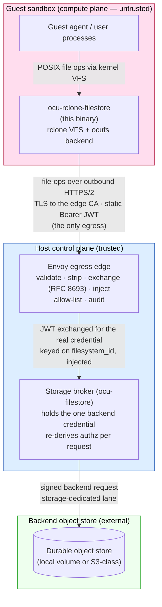
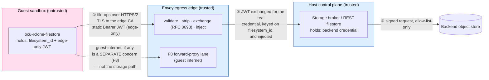
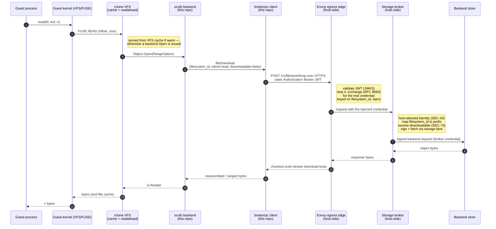
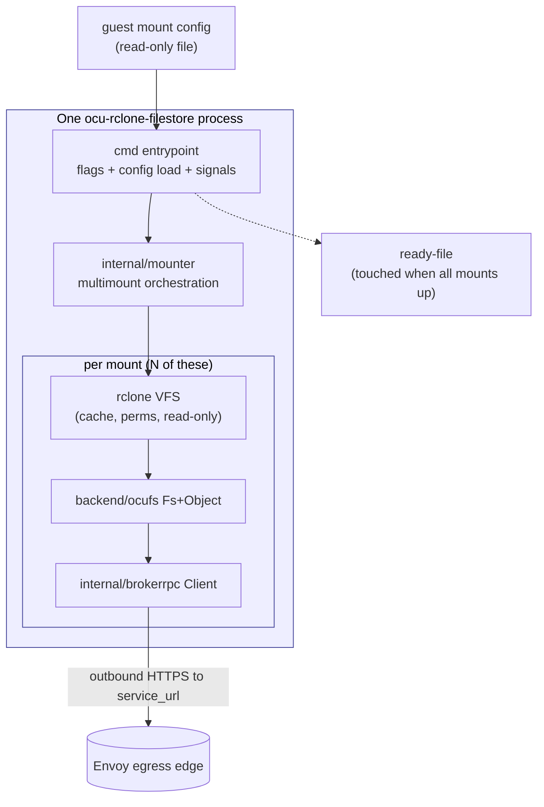

<!-- SPDX-License-Identifier: FSL-1.1-Apache-2.0 -->
<!-- Copyright (c) 2025 Open Computer Use Contributors -->

# Architecture — ocu-rclone-filestore

This document explains, end to end, what the guest-side mount binary is, where
it sits in the Open Computer Use system, the trust boundaries it lives inside,
how a single file operation travels from a process in the guest all the way to
durable storage, and which package in this repository discharges each promise.

The **source of truth** for the system architecture is the canon in
[`Wide-Moat/open-computer-use`](https://github.com/Wide-Moat/open-computer-use)
under `docs/architecture/`. This document restates the parts that bear on this
binary in the project's own words; where it cites a behaviour it cites a
contract (`contracts/storage/*.schema.json`), an NFR row
(`manifesto/02-nfrs.md`), or an ADR. It never re-decides what an ADR decided.

Companion documents:

- [`requirements.md`](./requirements.md) — the invariants and defaults the
  binary must satisfy, distilled from the canon.
- [`fork-shape.md`](./fork-shape.md) — why the binary is a thin wrapper module
  over rclone rather than a source fork, and the exact rclone seams it relies on.
- [`e2e-local.md`](./e2e-local.md) / [`ci-fuse-decision.md`](./ci-fuse-decision.md)
  — how the real end-to-end exercise is run and gated.

---

## 1. What this binary is, in one paragraph

It is the **guest-side mount binary**. It runs as an ordinary process inside the
session sandbox. Given a host-supplied mount configuration that names one or
more per-session filesystem scopes, it presents each scope as a directory tree
in the guest filesystem (a FUSE mount) and translates every file operation the
guest performs — `open`, `read`, `write`, `readdir`, `rename`, `unlink`, … —
into a call on the broker's file-operations service. It serves nothing, proxies
nothing, and exposes no network facade. It holds **no backend credential and no
object-store client**, and opens **no second transport**: the scope handle it
carries is a session-scoped `filesystem_id`, and its only egress is an outbound
HTTPS connection to the configured `service_url`, reached over TLS that trusts
only the inspecting edge's CA. On that connection it presents a static session
JWT — an edge-only assertion the egress edge exchanges for the real storage
credential — never a backend key.

The binary is built on [rclone](https://github.com/rclone/rclone) (MIT). rclone
supplies the FUSE/VFS mount machinery; this repository adds one backend package
(`ocufs`) that speaks the broker RPC where a stock rclone backend would speak an
object-store protocol, plus the multi-mount entrypoint that drives rclone's
mount machinery. The diff against upstream rclone is zero — see
[`fork-shape.md`](./fork-shape.md).

---

## 2. System context — where the mount sits

The binary is one participant in a larger system. The diagram below is the
context view, scoped to the storage path; the full system context lives in the
canon (`docs/architecture/03-c4-context.md`).

The Mermaid source below is the maintainable version of the same view; the
rendered SVG above is generated from [`diagrams/01-big-picture.d2`](./diagrams/01-big-picture.d2).

Key relationships:

- **The guest agent never talks to storage directly.** It performs ordinary file
  operations against a mounted directory; this binary is the only thing that
  turns those into a call on the file-operations service.
- **This binary never talks to the backend store directly.** Its sole outbound
  channel is an HTTPS connection to the configured `service_url`, which reaches
  only the egress edge; the REST filestore behind the edge is not directly
  dialable from the guest. There is no object-store client linked into the binary
  and no network path to any backend (SEC-25, SEC-16). The build-graph denylist
  CI gate enforces this mechanically.
- **The guest holds no backend credential.** It presents only a static session
  JWT — an edge-only assertion. The egress edge validates that JWT, strips it,
  and exchanges it (RFC 8693) for the real storage credential keyed on the
  validated `filesystem_id` before the request reaches the REST filestore.
- **The broker is the only component that holds the backend credential**, signs
  backend requests, and re-derives authorization for every operation.

---

## 3. Trust boundaries and the credential seam (the "hole in the host")

This is the load-bearing security property and the most common point of
confusion, so it is documented precisely. The question is: *if the guest holds
no backend credential, where do the bytes actually leave the trusted boundary,
and where is the real storage credential attached?*

The answer is that there is **no single backdoor "hole"** punched through the
host. The guest holds no backend key; it carries only a static session JWT, an
**edge-only assertion** that is useless past the egress edge. **Three distinct
host-side mediation points** stand between a guest file operation and durable
storage. The guest reaches the REST filestore only through one narrow,
host-mediated channel — an outbound HTTPS connection to the egress edge — and
the real credential is attached on the far side of that edge, never in the
guest.

### 3.1 The zones

| Zone | Trust | What runs there | Relevant to this binary |
|---|---|---|---|
| Compute plane | **Untrusted** | The session sandbox; the guest agent; **this binary** | This binary lives here. Anything it holds — including the static session JWT — is assumed reachable by an adversary, which is exactly why the JWT is an edge-only assertion, not a backend key. |
| Egress edge | **Trusted** | **The Envoy egress edge** the guest dials over HTTPS | The guest's only reachable peer. It validates the session JWT, strips it, exchanges it (RFC 8693) for the real storage credential keyed on `filesystem_id`, and injects that credential before the REST filestore. |
| Host control plane | **Trusted** | Session lifecycle; **the storage broker / REST filestore** | The filestore behind the edge holds the one backend credential and re-derives authorization per request. The guest never reaches it directly. |
| Backend object store | **External** | The durable store (local volume or S3-class) | This binary never names it, never dials it, never sees its protocol. |

### 3.2 The two egress lanes

There are two physically distinct lanes out of the trusted boundary, and they
carry different things:

- **The storage path is hop ① → ② → ③.** The guest's file-ops requests cross the
  sandbox boundary as **outbound HTTPS/2 over TLS** whose only trust anchor is
  the edge CA, carrying a **static Authorization Bearer session JWT** (hop ①).
  That JWT is an edge-only assertion — *no backend credential travels on hop ①*.
  The egress edge **validates the JWT against the control-plane JWKS, strips it,
  exchanges it (RFC 8693) for the real storage credential keyed on the validated
  `filesystem_id`, and injects that credential** before the REST filestore (hop
  ②). The filestore then originates the signed backend request, which leaves
  through the storage-dedicated egress path (hop ③, canon SEC-85): allow-list-only
  and audited. Because the exchange happens at the edge — out-of-process from the
  guest — a fully compromised guest still cannot obtain the real credential.
- **The guest-internet forward-proxy lane (F8)** is a *different* lane for a
  *different* purpose (a guest process reaching an allow-listed external API);
  it is where upstream-API credential injection happens (canon ADR-0005/0007,
  Envoy SDS). **This binary does not use it.** It is shown only to make clear
  that the storage path and the guest-internet path are separate.

### 3.3 The three credential-mediation points

1. **The egress edge is the narrow channel.** The guest's only way to reach
   storage is the outbound HTTPS connection to the egress edge. The edge
   validates the static session JWT, derives the caller's identity from that
   validated token — **host-attested, not guest-asserted** (SEC-43) — and
   exchanges the JWT for the real credential keyed on the validated
   `filesystem_id`. A `filesystem_id` the guest names in a request body is a
   *hint* the broker cross-checks against the edge-attested identity, not a
   capability.
2. **The broker custodies and signs.** The one backend credential lives only in
   the broker / REST filestore behind the edge. The broker maps `filesystem_id`
   to a backend prefix the guest never sees, resolves the object, checks the
   broker-side `downloadable` policy (SEC-73), and signs the backend request
   itself.
3. **The storage egress enforces, out-of-process.** The signed request crosses to
   the backend only through the storage-dedicated egress path, which forwards
   allow-list-only and emits an audit event per operation (SEC-85, SEC-16).

The net effect: the worst an adversary with full control of the guest can do is
issue file-ops against *its own* session scope, presenting *its own* edge-only
JWT. It cannot forge another session's identity (the edge attests identity from
the validated token, not the guest-asserted body), cannot obtain the backend
credential (it never enters the guest; the JWT is exchanged for it only at the
edge), cannot reach the REST filestore on a second path (no object-store client
is linked, the edge is the only reachable hop), and cannot turn a
non-downloadable object into an exfiltrable one (that decision is broker-resolved
and the guest never sets `downloadable=true`).

### 3.4 How this binary upholds its end

This binary's responsibility in the credential seam is **to hold no backend key
and to assert nothing it is not entitled to**. Concretely:

- It presents only the per-mount static session JWT, read once from config at
  construction and never refreshed; it holds no backend or object-store
  credential (`internal/brokerrpc`).
- It sends every request over TLS that trusts only the edge CA
  (`ca_cert_pem` from config) — it never reaches the REST filestore directly and
  never falls back to system-root trust (`internal/brokerrpc`).
- It has **no** code path that sets `downloadable` to `true` — the field is
  stamped `false` on every request body, centrally (`internal/brokerrpc`).
- It requests only `read` and `write` intents, never `preview`
  (`internal/brokerrpc`).
- It links **no** object-store client; the only egress is the configured HTTPS
  `service_url` to the edge (enforced by the build-graph denylist CI gate).

---

## 4. The data path of one file operation

The diagram below traces a guest `read()` of a file, from syscall to bytes,
naming every hop. A `write()` is the mirror image (the broker signs a `PutObject`
instead of a `GetObject`, and the upload is a multipart/form-data POST that
streams the source in ceiling-bounded chunks).

The rendered SVG above is generated from [`diagrams/02-file-path.d2`](./diagrams/02-file-path.d2);
the Mermaid sequence below is the maintainable source.

Two facts the diagram makes precise:

- **Where caching sits.** The rclone VFS holds a per-mount cache. A warm read is
  served locally without touching the broker — which is why the end-to-end test
  proves the *broker* data path by reading the broker's own workspace, not by
  reading back through the mount (a read-back can be cache-served).
- **Where authorization is decided.** Not here. The mount stamps `intent` (read)
  and `filesystem_id`, and always `downloadable=false`. The broker re-derives the
  three authorization axes against host-attested identity and decides. The mount
  is a translator, not a policy point.

---

## 5. The broker south face — the contract this binary speaks

The binary speaks exactly one protocol: the broker's file-operations RPC. The
operation set and authorization axes are pinned by
`contracts/storage/file-ops.schema.json` in the canon; the transport details are
the component spec's.

- **Transport.** REST-JSON over **outbound HTTPS/2**, TLS-trusting the edge CA,
  with a static `Authorization: Bearer <session JWT>` header on every request.
  Unary ops are `POST application/json` to `<service_url>/v1/filestore/fs/<Op>`.
  `fileUpload` is a `multipart/form-data` POST (a JSON `params` field plus a file
  part streamed in ceiling-bounded chunks). `fileDownload` returns a chunked
  `application/octet-stream` body, read to completion. Success or failure is the
  **HTTP status**: `429`/`503` map to a retryable back-off error (honouring
  `Retry-After`), `401` and `403` both collapse to permission-denied, and every
  other non-2xx is permanent.
- **The 18 operations.** `listDirectory`, `makeDirectory`, `moveDirectory`,
  `removeDirectory`; `createFile`, `readFile`, `readMetadata`, `getFileMetadata`,
  `listFiles`, `copyFile`, `moveFile`, `removeFile`; `fileUpload`, `fileDownload`,
  `importFiles`, `importZip`; `migrateFilesystem`, `removeFilesystem`. Each maps
  to a fixed `intent` via a single authoritative table; the mount issues only
  `read` and `write` intents (it never requests `preview`).
- **Three authorization axes, on every request.** `filesystem_id` (the scope
  handle, a *hint* the broker cross-checks against host-derived identity),
  `intent` (`read`/`write`, derived centrally from the op), and `downloadable`
  (always `false` from the guest — the perimeter-exit decision is broker-resolved,
  SEC-73).
- **Throttling and denials.** Per-session ceilings are broker-side (SEC-46). A
  retryable refusal (`resource_exhausted`/`unavailable`) is mapped to a
  back-off-with-retry error (honouring a `Retry-After` hint when present); the
  closed-class denials map to permanent errors. The mount tolerates throttling as
  backpressure; it never simulates or enforces a ceiling itself.

The detailed message map and chunk arithmetic live in the `brokerrpc` package
documentation; this section is the contract-level summary.

---

## 6. Container view — the runtime shape inside the guest

- **One process, N mounts.** A single process mounts every configured scope. Any
  failure to bring up any mount at start is a hard, non-zero exit — never a
  silently absent directory (SEC: component-04 south face; MNT-02).
- **Direct kernel mount.** The mounts use go-fuse's direct `mount(2)` path
  (`DirectMountStrict`), so the kernel mount needs only `/dev/fuse` and
  `CAP_SYS_ADMIN` and never execs a `fusermount` helper — the load-bearing
  property in a minimal static guest image that ships no such helper (see
  [`fork-shape.md`](./fork-shape.md)).
- **Readiness.** The entrypoint touches a ready-file once every mount is live and
  removes it on teardown; the ready-file path is a runtime input (flag/env), not
  a config-schema field.
- **Teardown.** `SIGTERM`/`SIGINT` triggers a graceful unmount of every mount.

---

## 7. Component decomposition — what each package owns

Every package below is authored in this repository (FSL-1.1-Apache-2.0). The
"discharges" column names the architecture promise the package is responsible
for upholding.

The rendered SVG above is generated from [`diagrams/03-package-map.d2`](./diagrams/03-package-map.d2);
the Mermaid graph below is the maintainable source.

### 7.1 `cmd/ocu-rclone-filestore` — the entrypoint

Parses `--config`, loads and validates the guest mount config, sources the
ready-file path (the one runtime input deliberately *not* in the frozen config
schema, from a flag with an env fallback), wires a termination-signal channel,
and drives the mounter. The transport is config-derived: `service_url`,
`auth_token`, and `ca_cert_pem` all come from the validated config, so there is
no socket flag. Every error path returns non-zero; a clean shutdown returns zero.
All logic lives in a testable `run`/`runWith` core so flag/env resolution is
asserted without spawning a process or mounting.

**Discharges:** hard-error session start (no silent skip); the runtime/config
split (the ready-file path is a runtime input; the transport is config-derived).

### 7.2 `internal/mountcfg` — the config loader

Strictly decodes the host-supplied guest mount config: unknown fields are
rejected, every structural rule is enforced with a distinct typed error
(absolute `destination`, `https://` `service_url`, octal perms, byte-size cap,
valid cache mode), and the XOR between `filesystem_id` and `memory_store_id` is a
hard error if both or neither is set. The config is single-shape: a top-level
`service_url` + `ca_cert_pem` and a `mounts` array whose entries each carry a
per-mount `auth_token` (the static session JWT). The loader **holds** these — a
mount missing its `auth_token`, or a config missing `ca_cert_pem`, is a hard
error — because the JWT is an edge-only assertion, not a backend key.

**Discharges:** SEC-25 (the guest config carries no backend credential — the
session JWT is exchanged for the real credential only at the edge); the XOR scope
rule; hard-error on malformed config.

### 7.3 `internal/contract` — schema conformance

Compiles the vendored mount-config schema and validates documents against its
**root**. The schema is a single shape — one top-level object with `service_url`
+ `ca_cert_pem` and a `mounts` array whose entries carry the per-mount
`auth_token` and the scope handle — so conformance is a straight root validation,
not a subschema selection. A document that violates the single shape (a bad
`service_url`, a missing `auth_token`, both/neither scope id) fails the schema.

**Discharges:** mount-config conformance against the vendored canon schema; the
single-shape contract the loader enforces in code.

### 7.4 `internal/brokerrpc` — the HTTPS/REST client

The guest-side client for the broker's file-operations service. It owns the
transport (REST-JSON over outbound HTTPS/2 to `<service_url>/v1/filestore/fs/<op>`,
TLS-trusting only the edge CA from `ca_cert_pem`; `multipart/form-data` upload;
chunked octet-stream download; ranged read), the static `Authorization: Bearer`
header (the session JWT read once at construction, never refreshed), the single
authoritative op→intent table, the central authorization-metadata stamp
(`filesystem_id`, `intent`, and always `downloadable=false`), chunk arithmetic
against the message ceiling, cursor pagination, and the mapping of HTTP statuses
to typed errors (`429`/`503` retryable-with-backoff honouring `Retry-After`, `401`
and `403` to permission-denied, everything else permanent). It holds no backend
credential and has no path that sets `downloadable=true` or refreshes the token.

**Discharges:** SEC-25 (no backend credential, one transport, one egress to the
edge); SEC-73 (`downloadable` is never guest-asserted); SEC-46 (throttle is
backpressure: it is mapped to a clean retryable error, never data loss); SEC-43
(the guest-supplied `filesystem_id` is sent as a hint, and correctness never
depends on it being trusted).

### 7.5 `backend/ocufs` — the rclone backend

Registers `ocufs` with rclone's backend registry and maps rclone's `Fs`/`Object`
surface onto the broker RPC through the `brokerClient` seam: `List`/`ListR` →
`listDirectory`; `NewObject` → metadata; `Open` (with a range option) →
`fileDownload`; `Put`/`Update` → chunked `fileUpload`; `Remove`,
`Copy`, `Move`, `Mkdir`/`Rmdir`/`DirMove` → their RPC analogues. It enforces
read-only mounts by returning a permission error at the *top* of every mutating
method, before any RPC. It constructs no `AuthorizationMetadata` and links no
object-store client — those concerns live entirely in `brokerrpc`.

**Discharges:** the read-only double-gate (enforced at the VFS layer in addition
to broker-side); the no-foreign-backend property (only the `brokerClient` seam is
reachable from here); path-encoding correctness on the wire.

### 7.6 `internal/mounter` — multimount orchestration

The seam between the loaded config and the live VFS mounts. It maps each config
mount to its VFS options (cache mode, cache size cap with the cleaner preserved,
dir-cache duration, dir/file perms, read-only), constructs the `ocufs` `Fs`,
hands it to rclone's mount machinery over the **direct kernel mount path**, fans
out N mounts, fails fast with best-effort cleanup of any already-started mount,
signals readiness exactly once after all are up, and tears every mount down on a
termination signal. It is build-tagged to the platforms the kernel mount method
supports and fails closed (typed "mount method unavailable") elsewhere.

**Discharges:** hard-error/fail-fast session start; per-mount read-only and cache
policy from config; the no-`fusermount`-helper property; graceful teardown.

---

## 8. Requirement → discharge map

Each architecture promise that bears on this binary, and where it is upheld in
code. The promises themselves are stated in [`requirements.md`](./requirements.md)
and pinned by the cited NFR row or contract.

| Promise | NFR / source | Upheld in |
|---|---|---|
| Guest holds no backend credential (only an edge-only session JWT) | SEC-25, mount-config contract | `internal/brokerrpc` (no backend key; JWT exchanged only at the edge), `internal/mountcfg` (strict-decode + single-shape validation), `internal/contract` (root conformance) |
| Exactly one of `filesystem_id`/`memory_store_id` (XOR) | mount-config contract | `internal/mountcfg` |
| Only the file-ops service, no object-store client, no second transport | SEC-25 / SEC-16 | `internal/brokerrpc` (one outbound HTTPS egress to the edge), `backend/ocufs` (only the `brokerClient` seam), build-graph denylist CI gate |
| Guest-supplied ids are hints; attribution is host-derived | SEC-43 | `internal/brokerrpc` (id sent as a hint; correctness never depends on it) |
| Read-only vs writable per mount, enforced at the VFS layer | mount-config contract | `internal/mounter` (VFS `ReadOnly`), `backend/ocufs` (top-of-method gate) |
| Throttling is backpressure, never data loss | SEC-46 | `internal/brokerrpc` (retryable-with-backoff mapping), rclone VFS (write-back retry) |
| `downloadable` is broker-resolved; the mount never enforces it | SEC-73 | `internal/brokerrpc` (always `downloadable=false`; never requests `preview`) |
| Mount failure at start is a hard error, never a missing directory | component-04 south face / MNT-02 | `internal/mounter` (fail-fast + fail-closed stub), `cmd` (non-zero exit) |

---

## 9. What is deliberately *not* here

- **Serving, share-by-link, preview, the north face.** Those are broker concerns.
  This binary only speaks the south-face file-operations service.
- **Authorization policy.** The broker re-derives the three axes per request; the
  mount is a translator with local caching, not a policy point.
- **Backend credential handling.** Covered in §3 — the guest holds no backend
  key; it carries only the edge-only session JWT, which the egress edge exchanges
  for the real credential.
- **A backend protocol.** No object-store client is linked; the only protocol the
  binary knows is the file-operations service over HTTPS/REST.

---

## 10. Where to go next

- The exact rclone seams and the wrapper-vs-fork rationale: [`fork-shape.md`](./fork-shape.md).
- The invariant/defaults table the binary is built against: [`requirements.md`](./requirements.md).
- Running the real end-to-end exercise that gates a release:
  [`e2e-local.md`](./e2e-local.md) and [`deploy/compose/README.md`](../deploy/compose/README.md).
- The canon (source of truth): the storage-broker component spec, the
  mount-config and file-ops contracts, and the SEC NFR rows in
  [`Wide-Moat/open-computer-use`](https://github.com/Wide-Moat/open-computer-use).
