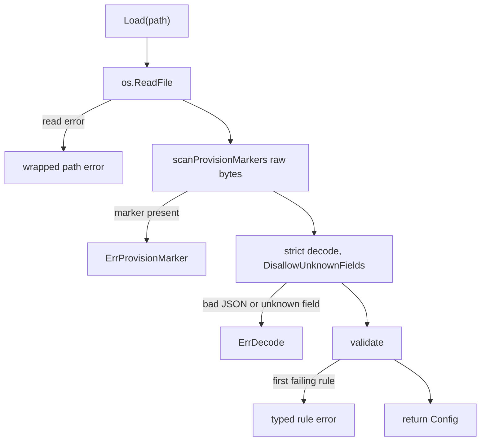

<!-- SPDX-License-Identifier: FSL-1.1-Apache-2.0 -->
<!-- Copyright (c) 2025 Open Computer Use Contributors -->

# `internal/mountcfg` — guest mount config loader

The guest binary is handed a JSON mount config at provision time. That JSON is
untrusted input, and `mountcfg` is the one place it becomes a typed `*Config`.
`Load` is the single door: it strict-decodes into the guest shape, validates
every structural rule, and refuses any provision-side credential marker. Nothing
downstream re-checks — a `*Config` from `Load` is the only evidence the rest of
the binary trusts, and `run.go` calls `Load` exactly once before it mounts
anything.

The struct deliberately has no credential field. The session-scoped
`filesystem_id` is the only backend handle the guest ever holds; the bearer is
injected at the egress edge and is never visible here. This loader is where the
guest half of SEC-25 — no backend protocol, no backend credential inside the
guest — is mechanically held.

## What a caller touches

`Load(path)` returns `*Config`, or one of this package's pointer-typed errors.
`Config` is the top level (`SchemaVersion`, `ServiceURL`, and the two mount
arrays `Mounts` and `ReadonlyMounts`); each entry is a `Mount`. Callers that
want to branch on *why* a config was rejected use `errors.As` against the
concrete `Err*` types described below.

The presence-sensitive `Mount` fields are pointers on purpose, so the loader can
tell an absent field from a zero value: `FilesystemID` and `MemoryStoreID` (the
scope), `Writes` (the RW/RO posture), and `CacheDurationS` (the freshness
window). A nil `CacheDurationS` is a missing field and is rejected; an explicit
`0` is legal. Collapsing any of these to a value type would silently accept an
absent field as its zero — that is a correctness break, not a simplification.

## The load path

`Load` is fail-fast and ordered. The credential pre-scan runs on the raw bytes
*before* strict decode, so a leaked marker surfaces as a legible
`ErrProvisionMarker` instead of being buried in a generic unknown-field decode
error.

`validate` checks the top level — `schema_version` pattern, `service_url`, then
required `mounts` presence — and hands each array to `validateMount`. The
`mounts` key must be present: a nil slice (absent or JSON `null`) is rejected
with `ErrMissingField`, while a present-but-empty array is legal. The same
`validateMount` enforces both arrays, parameterised by the posture each requires.

Code: mountcfg.go (Load, scanProvisionMarkers, validate, validateServiceURL, validateMounts, validateMount), run.go (Load call site).

## Structural rules and their errors

Every rule has its own concrete error type, returned as a pointer. Most carry
the array name (`mounts` or `readonly_mounts`, typed as `mountArray`) and the
entry index, so a message points an operator at the exact mount that failed.
Validation stops at the first failure, so the precedence below is also the order
in which a multiply-broken mount reports — reordering the checks changes which
error a caller sees.

Top-level:

| Field | Rule | Error |
| --- | --- | --- |
| `schema_version` | matches `^v[0-9]+(alpha\|beta)?[0-9]*$` | `ErrSchemaVersion` |
| `service_url` | literal `https://` prefix, then a parseable URI (`Reason` says which failed) | `ErrServiceURL` |
| `mounts` | key present (nil slice rejected) | `ErrMissingField` |
| any field | unknown to the guest shape, or malformed JSON | `ErrDecode` |

`ErrDecode` implements `Unwrap`, so the underlying `json` error stays reachable.

Per mount, in evaluation order:

| Field | Rule | Error |
| --- | --- | --- |
| `destination` | absolute, matches `^/.+` (bare `/` is rejected) | `ErrDestination` |
| scope | exactly one of `filesystem_id` / `memory_store_id` present | `ErrMountScope` |
| scope id | the present id is a non-empty string | `ErrScopeID` |
| `writes` | present and equal to the array's posture | `ErrWritesPosture` |
| `cache_duration_s` | present and `>= 0` (explicit `0` legal) | `ErrCacheDuration` |
| `dir_perms`, `file_perms` | octal, match `^0[0-7]{3}$` | `ErrPerms` |
| `vfs_cache_max_size` | match `^[0-9]+(B\|K\|M\|G\|T)?$` (suffix optional, not normalised) | `ErrByteSize` |
| `vfs_cache_mode` | one of `off` / `minimal` / `writes` / `full` | `ErrCacheMode` |

The byte-size string is passed through verbatim for the mounter to interpret;
`mountcfg` only checks its shape. `octalRe` wants exactly four digits with a
leading `0`, so a three-digit `755` is rejected.

Code: errors.go (every `Err*` type, `mountArray`), mountcfg.go (`schemaVersionRe`, `destinationRe`, `octalRe`, `byteSizeRe`, `cacheModes`).

## Scope is a true XOR

A mount names exactly one of `filesystem_id` or `memory_store_id`, mirroring the
schema's `oneOf`. The XOR keys on *presence*, not value, and presence is the
pointer-nil test — "the key appeared," whatever it was set to. So `ErrMountScope`
fires only when *both* fields are present or *neither* is. An explicit empty
string counts as present: paired with the other field's absence it satisfies the
XOR — exactly one present — and falls through to `ErrScopeID`, which rejects the
empty id separately, since a scope id must be a non-empty string. The pointer
types are what make "present" mean "the key appeared," which is why the scope
fields cannot become value types.

RW/RO posture is structural and checked both ways: `Mounts` entries must carry
`writes=true`, `ReadonlyMounts` entries `writes=false`. The array a mount lives
in and its flag must agree, so a write mount cannot hide in the read-only list,
and a missing flag is itself a posture failure.

## Refusing credential markers

The frozen contract defines the provisioning credential fields — `auth_token`
and `ca_cert_pem` — only on the host-side variant, never on the guest shape.
Strict decoding already rejects them as unknown fields, but `scanProvisionMarkers`
checks for them explicitly across the top level and every mount entry, returning
`ErrProvisionMarker` with the offending field and its location. The redundancy is
deliberate: it turns a credential leak into a named, independently testable
refusal rather than something indistinguishable from a typo. If the contract
ever adds another host-only field, it joins `provisionMarkers` here.

This is the structural form of SEC-25: the transport substrate and the backend
source path are intentionally not guest fields, so an attempt to smuggle them in
fails decode, and the named credential markers fail the pre-scan.

Code: mountcfg.go (`provisionMarkers`, scanProvisionMarkers), errors.go (`ErrProvisionMarker`).

## Parity with the schema

`mountcfg` must stay the exact executable image of the guest subschema. The
contract package's parity test feeds every fixture through both `Load` and the
schema validator and fails on any accept/reject divergence, so a rule that one
enforces and the other does not is a contract break. The schema in the
architecture repo is the source of truth — never loosen or tighten a rule here
without the matching change there.

Code: internal/contract/parity_test.go (TestLoaderSchemaParity).
