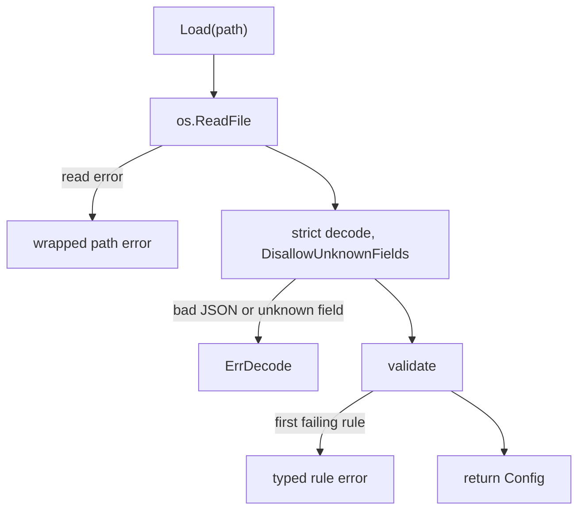

<!-- SPDX-License-Identifier: FSL-1.1-Apache-2.0 -->
<!-- Copyright (c) 2025 Open Computer Use Contributors -->

# `internal/mountcfg` — guest mount config loader

The guest binary is handed a JSON mount config at provision time. That JSON is
untrusted input, and `mountcfg` is the one place it becomes a typed `*Config`.
`Load` is the single door: it strict-decodes into the guest shape and validates
every structural rule. Nothing downstream re-checks — a `*Config` from `Load` is
the only evidence the rest of the binary trusts, and `run.go` calls `Load`
exactly once before it mounts anything.

The config carries the transport the guest speaks and the credential it
presents. The top level holds the egress endpoint (`service_url`, an `https://`
URL) and the trust anchor for that hop (`ca_cert_pem`); each mount holds its own
`auth_token`, a short-lived, scoped session JWT. That JWT is a Bearer the guest
presents on every outbound call and is therefore visible to this loader — it is
a required field, not a refused one. The egress edge is what validates the JWT,
strips it, and exchanges it for the real storage credential, so the guest never
holds a BACKEND or object-store key. The only backend handle the guest carries
is the session-scoped `filesystem_id`. This loader is where the guest half of
SEC-25 — no backend protocol and no backend credential inside the guest — is
mechanically held: the JWT it accepts is an edge-only assertion, never a
storage key.

## What a caller touches

`Load(path)` returns `*Config`, or one of this package's pointer-typed errors.
`Config` is the top level — `SchemaVersion`, `ServiceURL`, `CACertPEM`, and a
single `Mounts` array — and each entry is a `Mount`. Callers that want to branch
on *why* a config was rejected use `errors.As` against the concrete `Err*` types
described below.

The presence-sensitive `Mount` fields are pointers on purpose, so the loader can
tell an absent field from a zero value: `FilesystemID` and `MemoryStoreID` (the
scope), `Readonly` (the RW/RO posture), and `CacheDurationS` (the freshness
window). A nil `CacheDurationS` is a missing field and is rejected; an explicit
`0` is legal. A nil `Readonly` is a missing field and is rejected; both explicit
`true` and explicit `false` are legal. Collapsing any of these to a value type
would silently accept an absent field as its zero — that is a correctness break,
not a simplification.

## The load path

`Load` is fail-fast and ordered. It reads the file, strict-decodes with
unknown-field rejection, then validates every rule, stopping at the first
failure.

`validate` checks the top level — `schema_version` pattern, `service_url`,
required `ca_cert_pem` presence, then required `mounts` presence — and hands the
array to `validateMount`. The `mounts` key must be present: a nil slice (absent
or JSON `null`) is rejected with `ErrMissingField`, while a present-but-empty
array is legal.

Code: mountcfg.go (Load, validate, validateServiceURL, validateMounts, validateMount), run.go (Load call site).

## Structural rules and their errors

Every rule has its own concrete error type, returned as a pointer. The per-mount
errors carry the entry index, so a message points an operator at the exact mount
that failed. Validation stops at the first failure, so the precedence below is
also the order in which a multiply-broken mount reports — reordering the checks
changes which error a caller sees.

Top-level:

| Field | Rule | Error |
| --- | --- | --- |
| `schema_version` | matches `^v[0-9]+(alpha\|beta)?[0-9]*$` | `ErrSchemaVersion` |
| `service_url` | literal `https://` prefix, then a parseable URI (`Reason` says which failed) | `ErrServiceURL` |
| `ca_cert_pem` | non-empty | `ErrMissingField` |
| `mounts` | key present (nil slice rejected) | `ErrMissingField` |
| `backend_cache_ttl` | optional; accepted but not consumed by the guest (decoded only so strict decode and the frozen schema reach the same accept verdict) | — |
| any field | unknown to the guest shape, or malformed JSON | `ErrDecode` |

`ErrDecode` implements `Unwrap`, so the underlying `json` error stays reachable.

Per mount, in evaluation order:

| Field | Rule | Error |
| --- | --- | --- |
| `destination` | absolute, matches `^/.+` (bare `/` is rejected) | `ErrDestination` |
| `auth_token` | present and non-empty | `ErrAuthToken` |
| scope | exactly one of `filesystem_id` / `memory_store_id` present | `ErrMountScope` |
| scope id | the present id is a non-empty string | `ErrScopeID` |
| `readonly` | present (absent flag rejected; `true` and `false` both legal) | `ErrReadonlyMissing` |
| `cache_duration_s` | present and `>= 0` (explicit `0` legal) | `ErrCacheDuration` |
| `dir_perms`, `file_perms` | octal, match `^0[0-7]{3}$` | `ErrPerms` |
| `vfs_cache_max_size` | match `^[0-9]+(B\|K\|M\|G\|T)?$` (suffix optional, not normalised) | `ErrByteSize` |
| `vfs_cache_mode` | one of `off` / `minimal` / `writes` / `full` | `ErrCacheMode` |

The byte-size string is passed through verbatim for the mounter to interpret;
`mountcfg` only checks its shape. `octalRe` wants exactly four digits with a
leading `0`, so a three-digit `755` is rejected.

Code: errors.go (every `Err*` type), mountcfg.go (`schemaVersionRe`, `destinationRe`, `octalRe`, `byteSizeRe`, `cacheModes`).

## Scope is a true XOR

A mount names exactly one of `filesystem_id` or `memory_store_id`, mirroring the
schema's `oneOf`. The XOR keys on *presence*, not value, and presence is the
pointer-nil test — "the key appeared," whatever it was set to. So `ErrMountScope`
fires only when *both* fields are present or *neither* is. An explicit empty
string counts as present: paired with the other field's absence it satisfies the
XOR — exactly one present — and falls through to `ErrScopeID`, which rejects the
empty id separately, since a scope id must be a non-empty string. The pointer
types are what make "present" mean "the key appeared," which is why the scope
fields cannot become value types.

`memory_store_id` is a valid scope branch at config-load time: a mount that names
it parses and validates. Standing one up as a live FUSE mount is out of scope for
v1, so the mounter rejects a memory-store mount as a hard error rather than the
loader. The loader's job is to accept the well-formed shape; the v1 mount-surface
limit is enforced where the mount is built.

## RW/RO posture is per-mount

There is one `mounts` array, and each entry carries its own `readonly` boolean.
A read-only mount sets `readonly=true`, a writable mount `readonly=false`, and
the field is mandatory — an absent flag is itself a posture failure. The posture
is structural in the config and is enforced again at the VFS layer when the mount
is built, so a read-only mount cannot be written through even if a caller tries.

## Required transport and credential fields

The guest config carries the egress transport and the per-mount Bearer it
presents. `service_url` and `ca_cert_pem` are required top-level fields, and each
mount's `auth_token` is required and non-empty. The loader holds these rather
than refusing them: the JWT is the assertion the guest presents at the egress
hop, and `ca_cert_pem` is the trust anchor for that hop.

This is the structural form of SEC-25: the guest config names a single egress
endpoint and a scoped, edge-only JWT — never a backend object-store protocol and
never a backend storage credential. The egress edge validates the JWT, strips it,
and exchanges it for the real credential out of the guest's sight, so an
`auth_token` in this config is a session assertion, not a storage key.

Code: mountcfg.go (validate, validateServiceURL, validateMount), errors.go (`ErrAuthToken`, `ErrReadonlyMissing`, `ErrMissingField`, `ErrServiceURL`).

## Parity with the schema

`mountcfg` must stay the exact executable image of the guest subschema. The
contract package's parity test feeds every fixture through both `Load` and the
schema validator and fails on any accept/reject divergence, so a rule that one
enforces and the other does not is a contract break. The schema in the
architecture repo is the source of truth — never loosen or tighten a rule here
without the matching change there.

Code: internal/contract/parity_test.go (TestLoaderSchemaParity).
