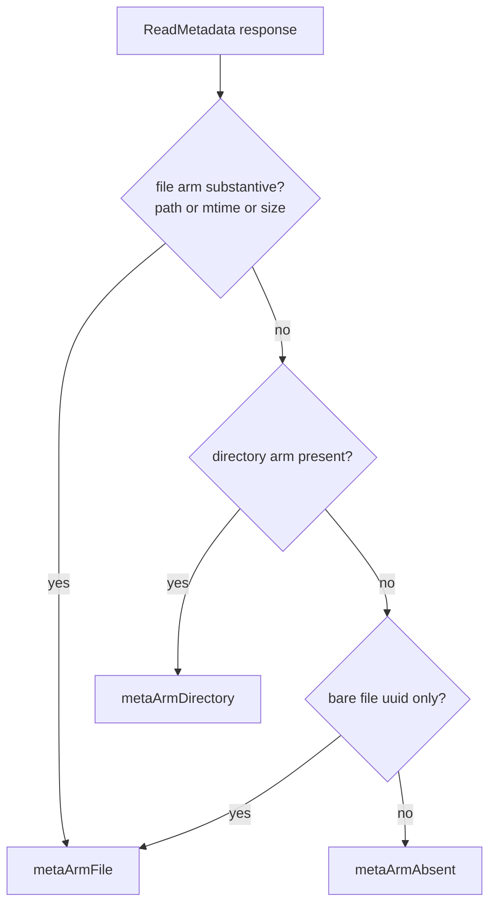

<!-- SPDX-License-Identifier: FSL-1.1-Apache-2.0 -->
<!-- Copyright (c) 2025 Open Computer Use Contributors -->

# ocufs — rclone backend for the file-store broker

`ocufs` is an rclone backend: it maps rclone's `Fs` and `Object` surface onto
the broker's file-operation RPC. Mount it like any rclone remote and the guest
sees a normal filesystem; underneath, every read, write, list, and rename is a
broker call. The backend is deliberately thin — it holds no backend credential,
links no object-store client, and opens no second transport. Its handles are the
broker's HTTPS `service_url`, a session-scoped `filesystem_id`, the static
session `auth_token`, and the `ca_cert_pem` trust anchor, all supplied by the
host at provision time. `init` registers the backend under the name `ocufs`,
so rclone discovers it through the standard registry.

Everything that touches the wire goes through the `brokerClient` interface,
which is the seam this package owns. Authorization metadata and the
`downloadable` axis are *not* constructed here — they are stamped centrally in
the `brokerrpc` layer that sits behind `brokerClient`. This package's job is the
translation, not the policy.

## Where the pieces live

| File | Holds |
| --- | --- |
| `ocufs.go` | `Fs`, `NewFs`, registry `init`, and the `Fs`-level methods: `List`, `NewObject`, `Put`, `Mkdir`, `Rmdir`; path helpers and the metadata arm classifier |
| `object.go` | `Object` and its `fs.Object` methods, including `Open`, `Update`, `Remove`, and the lazy `resolve` fallback |
| `copymove.go` | `Copy`, `Move`, `DirMove` |
| `client.go` | the `brokerClient` interface and its forwarding adapter onto `*brokerrpc.Client` |
| `options.go` | the `Options` struct, the registered option list, and the path-encoding choice |

## What a caller touches

`NewFs` builds an `Fs` from the mount config. It requires `service_url`,
`filesystem_id`, `auth_token`, and `ca_cert_pem` and fails fast if any is
missing; `read_only` defaults to false. It does not open the connection — the
first RPC does — so construction is cheap and an unreachable endpoint surfaces at
first use, not at mount.

The reachable types are the standard rclone pair: `Fs` for directory-level
operations and `Object` for a single file. A caller never constructs either
directly; they come back from `List`, `NewObject`, `Put`, `Copy`, and `Move`.

## Read path

Reads avoid a metadata round-trip wherever the listing already carries enough.

- `List` calls the recursive `ListDirectoryAll` and then applies a depth-1
  filter so only the immediate children of `dir` survive — the broker op pages
  recursively, but rclone's `List` contract demands exactly one level. Each
  surviving entry is classified by which arm of the listing union it carries:
  the file arm becomes a fully-populated `Object` (uuid, size, mime, mtime all
  present) built by `objectFromFile`, and the directory arm becomes an
  `fs.NewDir`. A listing of a path the broker does not have maps to
  `fs.ErrorDirNotFound`, so the VFS can tell a missing directory from a
  transport failure.
- `NewObject` is a point lookup via `ReadMetadata` — never an enumeration. It
  returns a populated `Object` for a file, `fs.ErrorIsDir` for a directory, and
  `fs.ErrorObjectNotFound` when neither arm is present.
- `Object.Open` addresses content by uuid. It decodes any `RangeOption` or
  `SeekOption` into an `(offset, length)` pair and calls `DownloadRange`, or
  `Download` for a full read, handing back the bytes in an `io.NopCloser`. A
  `RangeOption` end is inclusive, and `RangeOption.Decode` collapses all four
  range forms into that one conversion. A mandatory option `Open` does not
  understand is an error; a non-mandatory unknown one is ignored.

## Write path

Every mutating method on both `Fs` and `Object` returns
`fs.ErrorPermissionDenied` at the top of the method, before any broker call,
when the mount is read-only. This is the load-bearing invariant: a read-only
mount provably issues zero mutating RPCs. The guard lives in `Put`, `Mkdir`,
`Rmdir`, `Copy`, `Move`, `DirMove`, and on the `Object` side in `Update`,
`Remove`, and `SetModTime`.

- `Put` is the create-new path and uploads with overwrite off, so a colliding
  destination is a conflict rather than a silent replace. `Object.Update`
  overwrites in place with overwrite on — a single atomic `Upload` rather than a
  remove-then-upload that would leave a window where the path does not exist.
- `Mkdir` is idempotent: the broker's already-exists signal is swallowed and
  reported as success, matching rclone's contract and its conformance tests.
- `SetModTime` always returns `fs.ErrorCantSetModTime` with zero client calls —
  no broker op sets mtime — after the read-only guard has had its say.
- `DirMove` requires the source `Fs` to be the *same pointer* as this one. A
  type check alone is not enough: a second `ocufs` mount bound to a different
  `filesystem_id` is still an `*Fs`, and the broker's directory-move op is
  scoped to one `filesystem_id`. Pointer identity is what keeps the move inside
  a single scope; anything else returns `fs.ErrorCantDirMove`, and rclone falls
  back to copy-plus-delete, which crosses scopes correctly.

## The uuid-less Object and lazy resolve

Some broker acks — upload, copy, move — carry no metadata body, so the `Object`
they produce has no uuid yet. Since `Open` needs a uuid to address content,
`Object.resolve` is the defensive fallback: on the first access that needs them,
it fetches uuid, size, mtime, mode, and sha via `ReadMetadata`. It is a no-op
once a uuid is present, so `List`- and `NewObject`-built objects — the hot path
— never pay for it. `Open` calls `resolve` first, then guards explicitly against
a still-empty uuid so a missing handle becomes a clear diagnostic rather than a
broker rejection. `Update` deliberately clears the uuid after writing so the
next access re-resolves against the freshly written object.

## Arm classification — one predicate, no desync

A `ReadMetadata` response is a union: it may carry a file arm, a directory arm,
or neither. Two surfaces read it — `NewObject` and `resolve` — and they must
agree, so both route through the single predicate `classifyMetaArms` (wrapped by
`classifyReadMetadata`). The predicate decides by *arm presence*, not by
guessing from empty values, which closes two specific hazards:

- A legitimate zero-byte file can have empty path, size, and uuid. Because a
  real file always carries an mtime, mtime is part of the file-arm presence
  test, so such a file classifies as a file rather than as not-found.
- A malformed dual-arm response — a directory arm plus a stray file uuid — must
  resolve to a directory. A lone uuid is not treated as a substantive file
  signal, so the directory arm wins.

Code: `ocufs.go` (`classifyMetaArms`, `classifyReadMetadata`, `metaArm`).

## Paths and encoding

`absPath` turns an rclone-relative path into the clean absolute path the broker
addresses: it joins against the `Fs` root, applies the on-wire encoding, and
runs `cleanPath` so the result always starts with `/` and never carries a
trailing slash. The encoding (`defaultEncoding`) escapes the bytes that are
unsafe or ambiguous in a path component — control characters, invalid UTF-8,
backslash, double-quote, and a trailing space or period — so a file whose name
contains them stores and retrieves losslessly. The `/` separator is never
encoded; the broker expects it literally as the only separator. On the way back,
`immediateChildRemote` decodes wire segments to standard encoding so rclone sees
the original name, and it is also where the depth-1 list filter is enforced.

## Capabilities and what stays unsupported

`Features` advertises `Copy`, `Move`, `DirMove`, `ReadMimeType`, and empty
directories. Two omissions are intentional:

- `PutStream` is not advertised. rclone spools an unknown-size source upstream
  and re-calls `Put` with a known size, so the backend never needs an
  unknown-total upload path and `declared_size_bytes` is always real.
- `ListR` is not advertised. `List` already filters the recursive
  `ListDirectoryAll` down to depth-1, which covers rclone's VFS recursion; a
  dedicated recursive surface is deferred.

`Hashes` reports an empty set and `Object.Hash` returns `hash.ErrUnsupported`:
the wire carries a `sha` field whose type and key are not yet pinned, so a
caller reads "unsupported" rather than mistaking an unset value for a real
empty-string hash. `Precision` reports `time.Second` as the safe lower bound on
the broker's RFC3339 mtime strings; `parseMtime` decodes them tolerantly,
returning the zero time on a parse failure rather than failing the operation.

## The broker seam

`brokerClient` is the only path to the wire, and the `Fs` holds it as an
interface so a test double can stand in without the real transport. Each method
mirrors a method on `*brokerrpc.Client` exactly, and `brokerClientAdapter`
forwards each one verbatim with no added logic, so the interface and the
underlying client stay in lock-step by construction. Content delivery
(`Download`, `DownloadRange`) is addressed by uuid; everything else is addressed
by path. Notably absent from the interface: any way to set authorization
metadata or the `downloadable` flag — those are not this package's concern.
