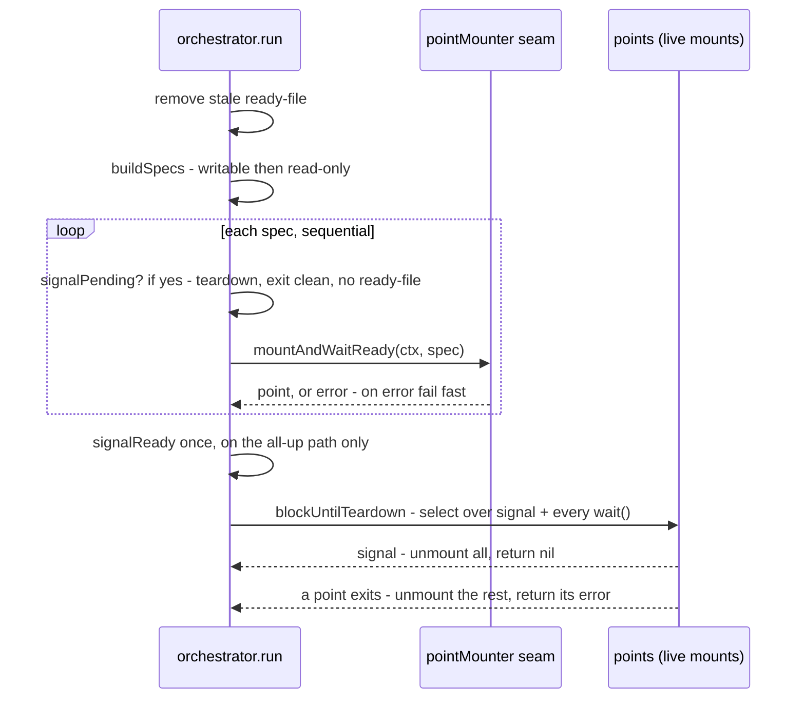

<!-- SPDX-License-Identifier: FSL-1.1-Apache-2.0 -->
<!-- Copyright (c) 2025 Open Computer Use Contributors -->

# mounter — config to live FUSE mounts

`internal/mounter` turns a validated guest mount config into running kernel
mounts and owns their whole lifecycle. One config entry becomes one mount; the
package fans them out, decides when the session is ready, and tears everything
down on a signal. Underneath each mount is an `ocufs` Fs scoped by
`filesystem_id`, wrapped in a `mountlib.MountPoint`, served over a first-party
FUSE frontend that performs the `mount(2)` syscall itself.

The package splits cleanly in two. The orchestration policy is
platform-independent and depends on nothing but a two-method seam, so it is
provable over a fake with no kernel mount. The kernel-touching production seam
is build-tagged to the platforms whose mount method this binary supports, and a
negated-tag stub fails closed everywhere else.

Callers touch only `New` and the `Mounter` interface. `New` returns an
`orchestratorMounter` wired with the production seam and accepts functional
options — `WithReadiness`, `WithSignals` — that thread the entrypoint's runtime
inputs without changing the single `Mount(cfg)` method. The transport is
config-derived: the top-level `service_url` + `ca_cert_pem` and each mount's
`auth_token` come from the validated config, so there is no socket option.

## Multimount orchestration

`orchestrator.run` is the spine. It builds an ordered spec list, fans out one
mount per spec, signals readiness once, then blocks until teardown. The
non-linear part is the wait at the end — a signal and N spontaneous point-exits
race each other — so that is the only flowchart this doc earns:

**Fan-out is sequential, by design.** `run` starts each spec one at a time so
the failed destination is deterministic for error attribution, not a race. The
specs are ordered writable-first by `buildSpecs`, which also rejects two hard
errors before any mount starts: a memory-store mount (there is no memory scope
axis yet) and a destination that repeats across the writable and read-only
arrays (the second would silently shadow the first). Each spec is stamped with
the config-derived transport here: the top-level `service_url` + `ca_cert_pem`
and the mount's own `auth_token`.

**Fail-fast with best-effort cleanup.** The first `mountAndWaitReady` error ends
the run. `run` best-effort-unmounts everything already up through `unmountAll`
and returns a single `errors.Join` naming the failed destination plus any
cleanup errors. No half-mounted session is ever left behind, and no later spec
is attempted after the first failure.

**Readiness fires exactly once, never after a termination request.**
`signalReady` runs only on the all-up path. When a `ReadyFilePath` is
configured it creates and truncates that file — a pure presence signal carrying
no bytes; otherwise it logs one readiness line. `run` polls `signalPending`
before each mount *and* once more after the last mount completes, so a signal
that lands anywhere during startup routes to `shutdownDuringStartup` (clean
teardown) and the ready-file is never created. Ready-file hygiene closes the
other end: `run` removes any pre-existing file at the start so a stale file from
a dead process cannot advertise "ready", and a deferred retraction removes it on
every exit path. Net effect — the file exists only while every mount is
actually up.

**Signal teardown.** When no signal channel is injected, `run` installs a
default `SIGTERM`/`SIGINT` one. After all mounts are up, `blockUntilTeardown`
builds a `reflect.Select` over that channel plus a goroutine-fed channel per
point's `wait()`. A signal unmounts everything and returns nil; a point that
exits on its own unmounts the rest and surfaces that point's wrapped error. The
fan-out itself runs under a cancelable `mountCtx` so a signal arriving
mid-mount aborts the in-flight readiness poll rather than letting it block to
the timeout.

The orchestrator never constructs a mount. It depends only on `pointMounter`
(`mountAndWaitReady`, `unmount`) and the opaque `point` handle (`destination`,
`wait`). That two-method surface is the whole testability fulcrum: a fake that
records calls and can fail the Nth start proves fan-out, fail-fast aggregation,
readiness ordering, and signal teardown with no kernel involved.

A note on the transport: it is config-derived, not a runtime flag/env. The
top-level `service_url` (loader-checked `^https://`) and `ca_cert_pem` plus each
mount's `auth_token` come straight from the validated config and are stamped onto
each spec; there is no socket input to resolve. An N-scope config dials the
egress edge over its single `service_url`, one `ocufs` Fs per `filesystem_id`.

Code: orchestrator.go (run, buildSpecs, signalReady, signalPending,
shutdownDuringStartup, blockUntilTeardown, unmountAll).

## VFS option mapping

`buildVFSOptions` maps one config mount to the VFS cache and permission options;
`buildMountOptions` maps the FUSE mount options. Both start from a **copy of the
package-level registered defaults** (`vfscommon.Opt`, `mountlib.Opt`) and
override only the knobs they own.

Starting from the registered defaults is load-bearing, not stylistic. Building
`buildVFSOptions` from a zero `vfscommon.Options{}` literal would zero
`CachePollInterval`, and a zero poll interval disables the vfscache cleaner —
the only thing that enforces `CacheMaxSize`. The configured `vfs_cache_max_size`
would become decorative and the hold-dirty-bytes-across-a-throttled-retry
mechanism would silently not exist. Keeping the defaults preserves the cleaner
and every other sane non-mapped value.

`buildVFSOptions` overrides exactly: `vfs_cache_mode` to `CacheMode`,
`vfs_cache_max_size` to `CacheMaxSize`, `cache_duration_s` to `DirCacheTime`,
`dir_perms` to `DirPerms`, `file_perms` to `FilePerms`, plus `Umask` and
`ReadOnly`. `Umask` is forced to 0 so a later `Options.Init` masks no bits off
the configured perms. `ReadOnly` carries the per-spec posture. `buildMountOptions`
overrides only `AllowOther`, set true so a non-root VFS server can let other
uids read the mount.

One sharp edge lives in the size mapping. `fs.SizeSuffix.Set` reads a trailing
digit as a KiB multiplier, so a bare `1048576` parses as 1 GiB — a 1024x cap
blowout that matters under per-session ceilings. `isAllDigits` detects a
unitless value and appends `"B"` to force a bytes reading; suffixed values pass
through. Do not remove this without re-checking the contract's `ByteSize`
pattern.

`buildOcufsConfigmap` writes the keys the backend reads: `service_url`,
`auth_token`, `ca_cert_pem`, `filesystem_id`, `read_only`. The transport triplet
(`service_url` + `ca_cert_pem` from the top-level config, `auth_token` from this
mount) is what the backend threads into `brokerrpc`; `filesystem_id` is the sole
scope handle. A memory-store mount or an empty `filesystem_id` is a hard error
here too.

## The direct kernel-mount path

`directMountFn` is the first-party `mountlib.MountFn`. It serves the VFS over
FUSE through go-fuse's direct `mount(2)` path with `DirectMountStrict` always
set, so go-fuse performs the mount syscall itself and **never execs a fusermount
helper**. The mount needs only `/dev/fuse` and `CAP_SYS_ADMIN`.

That is the load-bearing property for a minimal static guest image: there is no
fusermount tooling to ship in a static image, and a helper subprocess is one
more thing that can deadlock or be killed mid-mount. `DirectMountStrict` has no
helper fallback, so a missing helper can never become a runtime mount failure.
This is also why the production seam does **not** use the registry-resolved
`mount2` function — without `DirectMount` set, go-fuse's default path would exec
a helper this image does not carry. The rclone-to-FUSE node tree still comes
from rclone's own `mount2.NewFS` and `(*FS).Root` through its exported surface,
so file operations map exactly as upstream maps them and the diff stays zero;
only the server assembly (`fusefs.NewNodeFS` + `fuse.NewServer`) lives here.

Because the option string goes raw into the syscall with no helper to parse it,
`buildFuseMountOptions` rejects the two axes the kernel cannot read —
`allow_root` (a helper concept) and `ExtraFlags` (helper-era flags) — with
`errUnsupportedDirectMountOption`, turning a latent misleading `EINVAL` into a
typed, attributable error. `--write-back-cache` is logged and ignored rather
than silently dropped. Only kernel-recognized `ExtraOptions` may ride the
option string.

Teardown order matters and is fixed in `serveFuse`: the unmount closure shuts
the VFS down first, so in-flight writes flush, then detaches the kernel mount.
The terminal value lands on the error channel only after the serve loop exits
and `srv.Wait` drains, so a consumer sees a fully quiesced server. This is none
of it a transport — it is a kernel mount frontend, and the only network
path remains the backend's outbound HTTPS connection to the configured `service_url`.

`directMountFn` and the production point seam share the `linux ||
(darwin && amd64)` build tag. On linux the kernel can be polled for readiness;
the darwin/amd64 leg is a build convenience that cannot, so readiness there is
blind-trusted and a few volume options are added. Linux is the only
kernel-verified production target.

Code: directmount.go (directMountFn, buildFuseMountOptions, serveFuse,
buildNodeFSOptions, errUnsupportedDirectMountOption).

## Production seam vs fail-closed stub

`New` always wires `defaultRealSeam`, but which `defaultRealSeam` compiles
depends on the build tag. On a supported platform it builds `realPointMounter`
over `directMountFn`. On every other platform/arch the negated-tag file's
`defaultRealSeam` returns `errMountMethodUnavailable` — the typed fail-closed
error that the session surfaces so `main` exits non-zero. A mount is never
silently skipped (MNT-02), and `go build ./...` stays green on every target
while the binary refuses to mount where it cannot. The two `defaultRealSeam`
definitions carry exactly-negated tags and must stay mutually exclusive.

The seam is constructed through `newSeam`. `orchestratorMounter` stores
`newSeam` and `run` calls it on entry (the fake-driven tests inject the seam
directly and leave `newSeam` nil). On an unsupported platform the constructor
returns `errMountMethodUnavailable`, so the session fails closed before any mount
is attempted.

`realPointMounter.mountAndWaitReady` is where one spec becomes a kernel mount.
It builds the configmap, finds and instantiates the `ocufs` Fs, builds the VFS
and mount options, wraps a `mountlib.NewMountPoint`, starts it, and confirms
readiness. Two non-obvious points:

- **The Fs name is `"ocufs-"+dest`, unique per destination, and the root stays
  empty.** rclone's `vfs.New` keeps a package-level active-VFS cache keyed on
  `(ConfigString, Options)`. Two mounts with identical mapped VFS options — the
  common case — would share one cached VFS, and the second mount would silently
  serve the *first* filesystem. The destination is the natural unique axis. The
  root must stay empty because the backend joins root into broker paths; scope
  comes from the configmap's `filesystem_id`, not the display-only name.
- **`waitReady` polls `CheckMountReady`, never `mountlib.WaitMountReady`.** That
  helper reads the daemon pid unconditionally on every poll, and this binary's
  non-daemon `mp.Mount()` always returns a nil daemon, so calling it would
  nil-pointer crash on the first not-ready poll. The exported, nil-safe
  `CanCheckMountReady` / `CheckMountReady` primitives carry zero upstream diff.
  Polling runs every 100 ms until live, the 30 s deadline, or ctx cancellation.

`realPoint` bridges a live `MountPoint` into the orchestrator's `point`. Its
`doUnmount` drains the write-back queue (`WaitForWriters` then `FlushDirCache`)
before `mp.Unmount`, bounded by `writebackDrainTimeout`, so a SIGTERM teardown
flushes dirty bytes to the broker instead of dropping the most recent writes. A
`sync.Once` keeps *our* unmount path single-call when signal-teardown races a
spontaneous exit; `MountPoint.Wait` runs its own internal finalise that also
unmounts, which is rclone-internal and not deduplicatable from here — the Once
removes the double-call from our code, the residual race is upstream's.

This package opens no second transport and holds no backend credential. The only
Fs edge is the blank-imported `ocufs` backend, and the only network path is
that backend's outbound HTTPS connection to the configured `service_url`. The local disk backend is blank-imported
solely so the VFS cache directory can be built — a disk backend for the cache
dir, not an object-store client.

Code: realpoint.go (mountAndWaitReady, waitReady, doUnmount, defaultRealSeam,
newRealPointMounter), realpoint_unsupported.go (defaultRealSeam),
mounter.go (errMountMethodUnavailable, orchestratorMounter, New).
